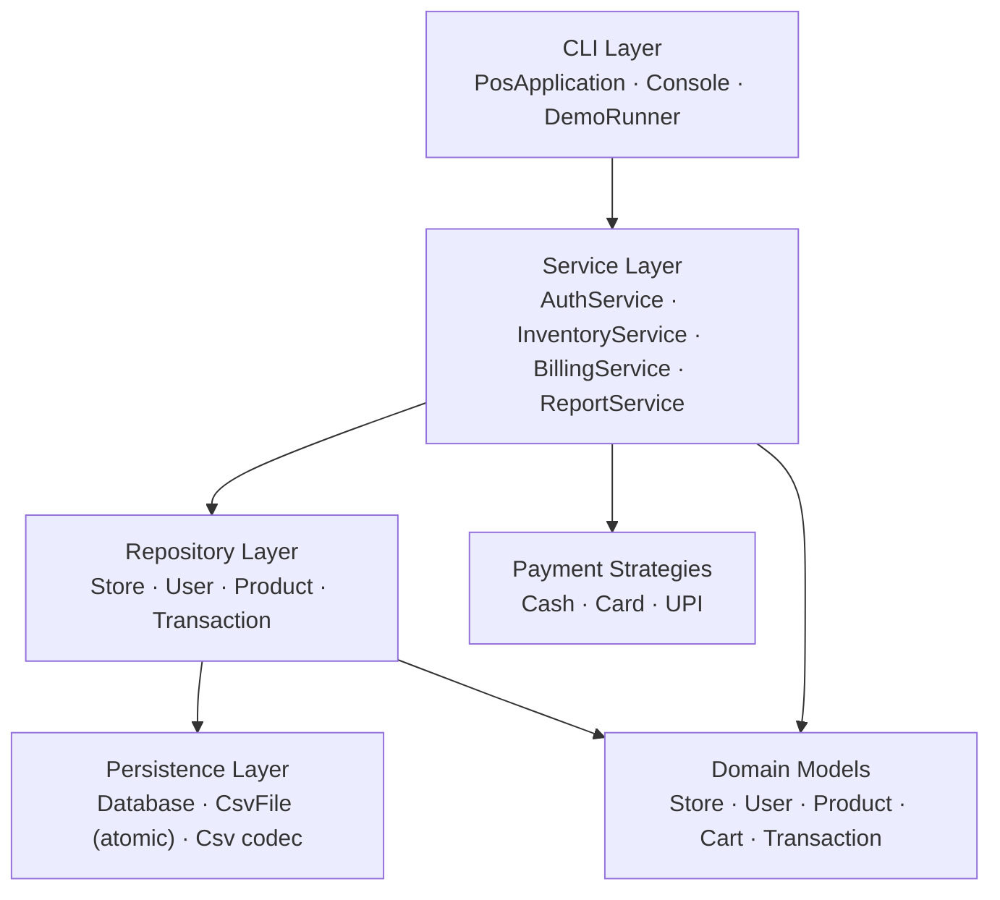

# 🏪 Multi-Store POS System

[](https://github.com/Rudrasamadhiya/POSSystem/actions/workflows/ci.yml)
[](https://openjdk.org/)
[](#-build--run)
[](LICENSE)

A **point-of-sale and inventory-management system** for multi-tenant retail
(think a chain of stores, each with its own catalogue, staff and sales),
written in **pure, object-oriented Java with zero third-party dependencies**.

It demonstrates clean layered architecture, classic design patterns, a
**transactional billing engine** that never oversells stock, salted password
hashing, and **pluggable persistence** — local CSV files by default, or
**PostgreSQL** in production behind the same interfaces. The codebase compiles
against nothing but the JDK (the PostgreSQL JDBC driver is the only runtime
add-on), and both storage backends are exercised in CI.

> Re-engineered from an earlier prototype into a proper OOP backend with a test
> suite and continuous integration.

---

## ▶️ Try it

- **🌐 Live demo:** _paste your Render URL here after deploying_ → `https://pos-system-xxxx.onrender.com`
- **🧑‍💻 Run it in your browser — no install:**

  [](https://shell.cloud.google.com/cloudshell/editor?cloudshell_git_repo=https://github.com/Rudrasamadhiya/POSSystem)
  [](https://gitpod.io/#https://github.com/Rudrasamadhiya/POSSystem)

  In the browser terminal: `./build.sh && java -jar out/pos-system.jar`  (CLI)
  &nbsp; or &nbsp; `java -jar out/pos-system.jar --web`  (web dashboard).

- **🚀 One-click deploy your own live link:**

  [](https://render.com/deploy?repo=https://github.com/Rudrasamadhiya/POSSystem)

---

## ✨ Features

**Multi-tenant core**
- Every store is an isolated tenant — its own products, staff and sales ledger.
- Data isolation enforced at the service layer (a store can only ever see its own rows).

**Authentication & roles**
- Salted **PBKDF2-HMAC-SHA256** password hashing with constant-time verification — no plaintext, no third-party crypto lib.
- Role-based access control: `ADMIN` ▸ `MANAGER` ▸ `CASHIER`, with privilege ordering.

**Inventory management**
- Add / update / delete products, barcode lookup, free-text search (name · barcode · category).
- **Low-stock alerts** driven by a per-product reorder threshold.
- Restock / stock-adjustment with validation (stock can never go negative).

**Billing engine** (the heart of the system)
- Cart with automatic line-merging and exact `BigDecimal` money math.
- **Transactional checkout**: validates all stock *before* mutating anything, so a sale is all-or-nothing.
- **Automatic rollback** if persistence fails mid-write — the catalogue is left exactly as it started.
- Concurrency-safe so two cashiers can't both pass validation and jointly oversell (the classic check-then-act race).
- Pluggable payment methods (Cash / Card / UPI) via the **Strategy pattern**.
- Printable text receipts.

**Reporting & analytics**
- Total & daily revenue, best-selling products, payment-method mix.
- One-click **CSV export** of the sales ledger.

**Web dashboard** (optional, same zero-dependency Java)
- A live dashboard served by the JDK's built-in `HttpServer` — **no Spring, no servlet container, no jars**.
- JSON API (`/api/summary`, `/api/products`, `/api/top`, `/api/daily`, `/api/payments`, `/api/sell`) over the exact same service layer the CLI uses.
- Ring up a sale from the browser and watch stock + analytics update live.
- Containerised and deployable to a real `https://` URL (see [Deploy](#-deploy-a-live-link)).

**Pluggable persistence** (CSV ⇄ PostgreSQL)
- Repositories sit behind interfaces, so storage swaps with **zero changes** to business logic.
- **CSV backend** (default): human-readable tables, RFC-4180 quoting, **atomic crash-safe writes** (temp file + atomic move) — no setup, nothing to install.
- **PostgreSQL backend** (production): real JDBC repositories with a connection-per-op model and **transactional commit/rollback** for sales. Activated automatically when a `DATABASE_URL` is present.
- The JDBC code uses only `java.sql` (JDK), so the project still **compiles with zero dependencies** — the Postgres driver is the single *runtime-only* dependency, added in Docker.
- Both backends are verified end-to-end in CI.

---

## 🏛️ Architecture

A strict, one-directional **layered architecture** — each layer depends only on
the layer beneath it:



### Design patterns used

| Pattern | Where | Why |
|---|---|---|
| **Repository** | `repository/*` | Decouples business logic from CSV storage behind a generic CRUD contract. |
| **Template Method** | `AbstractCsvRepository` | Base class handles loading, id-generation, locking & atomic persistence; subclasses only map a row ↔ entity. |
| **Strategy** | `service/payment/*` | Each tender type is its own class; adding one doesn't touch the billing engine. |
| **Factory** | `PaymentProcessor` | Resolves a `PaymentMethod` to its strategy. |
| **Facade / Unit of Work** | `Database` | Single entry point owning the four repositories and their shared state. |
| **Service Layer** | `service/*` | Encapsulates all business rules and validation. |

### Engineering highlights
- **Transactional consistency without a database** — validate-then-apply plus rollback gives all-or-nothing semantics over plain files.
- **Crash-safe persistence** — atomic file replacement means the on-disk table is always a complete, consistent snapshot.
- **Thread safety** — repositories guard state with a `ReentrantReadWriteLock`; checkout is synchronized to prevent oversell races.
- **Custom exception hierarchy** rooted at `PosException` for precise, catchable error handling.
- **`BigDecimal` money** throughout — no floating-point rounding bugs in totals.

---

## 📂 Project structure

```
POSSystem/
├── src/main/java/com/rudra/pos/
│   ├── Main.java                  # entry point (interactive or --demo)
│   ├── app/                       # CLI: PosApplication, Console, DemoRunner
│   ├── model/                     # Store, User, Product, Cart, Transaction, enums
│   ├── exception/                 # PosException hierarchy
│   ├── persistence/               # Database facade, CsvFile (atomic I/O)
│   ├── repository/                # generic + concrete repositories
│   ├── service/                   # Auth, Inventory, Billing, Report
│   │   └── payment/               # Strategy + Factory for tenders
│   ├── util/                      # PasswordHasher, Csv, Money, ReceiptPrinter
│   └── seed/                      # DemoData seeder
├── src/test/java/com/rudra/pos/   # zero-dependency test suite (TestMain, Assert)
├── .github/workflows/ci.yml       # compile + test + run demo on every push
├── build.sh / build.bat           # one-command build (JDK only)
└── pom.xml                        # optional Maven build
```

---

## 🚀 Build & Run

**Requirements:** a JDK 11 or newer. **No Maven, no internet, no dependencies.**

### Option A — build script (recommended)
```bash
# macOS / Linux
./build.sh

# Windows
build.bat
```
This compiles the sources, packages a runnable jar, then compiles and runs the
full test suite.

### Option B — Maven
```bash
mvn package
```

### Run it
```bash
# Interactive POS (seeds a demo store on first launch)
java -jar out/pos-system.jar

# Scripted, non-interactive walk-through (seed → sell → reports)
java -jar out/pos-system.jar --demo

# Web dashboard — then open http://localhost:8080
java -jar out/pos-system.jar --web
```

### Demo credentials
| Account | Login | Password |
|---|---|---|
| Store admin | `BHOPAL01` | `admin123` |
| Cashier | `ravi` | `cashier123` |
| Manager | `neha` | `manager123` |

---

## ✅ Testing & CI

The project ships a hand-rolled, dependency-free test suite (`TestMain`) covering
the CSV codec, password hashing, authentication, inventory rules, the
transactional billing engine (including oversell rejection and rollback), a
persistence reload test, and reporting. It exits non-zero on any failure.

Every push runs **GitHub Actions CI** (`.github/workflows/ci.yml`): it compiles
the project on JDK 17, runs the test suite, and executes the end-to-end demo —
so the badge at the top reflects a genuinely working build.

```bash
# run just the tests locally
./build.sh        # tests run as the final step
```

---

## 🚀 Deploy a live link

The web mode is containerised, so you can put it on a public URL for free. The
repo already includes a `Dockerfile` and a `render.yaml` blueprint.

**Render (recommended, free):**
1. Push this repo to GitHub.
2. Go to [render.com](https://render.com) → **New ▸ Blueprint** → select this repo.
   Render reads `render.yaml`: it provisions a **free PostgreSQL database**, builds the
   `Dockerfile`, wires `DATABASE_URL` into the web service, and deploys.
3. When it finishes you get a URL like `https://pos-system-xxxx.onrender.com`.
   Open it → the dashboard loads with the seeded demo store, now backed by Postgres.
4. Paste that URL into the **Live demo** line near the top of this README.

> The app uses PostgreSQL when `DATABASE_URL` is set (so **data persists** across
> restarts) and falls back to local CSV files otherwise. Free Render instances
> sleep after inactivity, so the first request after idle can take ~30s to wake.

**Run it in a browser instead (no deploy):** use the **Open in Cloud Shell** /
**Gitpod** buttons at the top, then run `java -jar out/pos-system.jar --web`.

## 🎥 Record a demo (optional)

To embed a recording of the CLI in this README:

```bash
# Option A — terminal recording (asciinema)
asciinema rec demo.cast -c "java -jar out/pos-system.jar --demo"
# upload, then paste the player link here

# Option B — animated GIF
#   run the --demo command and screen-record it with ScreenToGif (Windows)
#   or Kap (macOS), save as docs/demo.gif, then reference it:
#   
```

---

## 🗺️ Roadmap

- [ ] REST API layer (Spring Boot) over the same service core
- [ ] Pluggable storage backend (swap CSV for SQLite/Postgres behind the `Repository` interface)
- [ ] Web/JavaFX front end reusing the service layer
- [ ] Receipt export to PDF / thermal printer
- [ ] Per-role permission checks enforced in the CLI menus

---

## 📄 License

Released under the MIT License — free to use and modify.

---

<div align="center">
Built by <b>Rudra Samadhiya</b> · IIIT Bhopal
</div>
